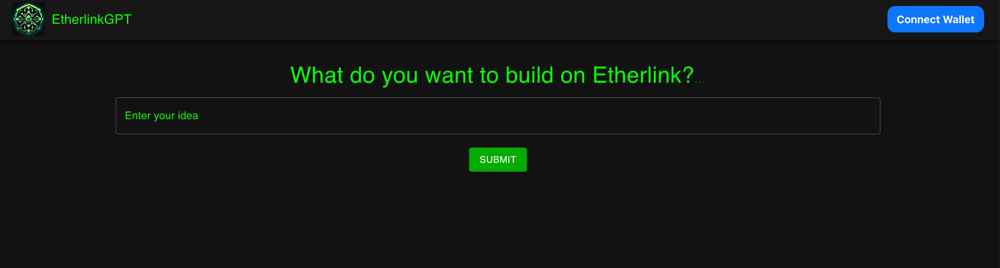
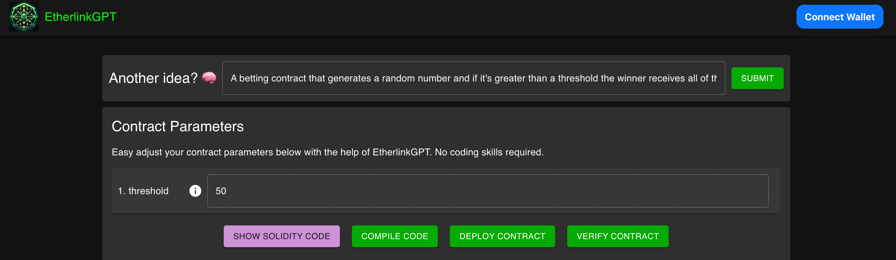

# EtherlinkGPT - The no code solution for Etherlink
EtherlinkGPT let's anyone create abritrary smart contracts on Etherlink with ease. EtherlinkGPT is powered by large language models (LLM) to produce high quality solidity code. Just type in your idea and get started. The contract is automatically deployed on Etherlink and can be verified with one-click, abstracting away unnecessary technicalities.

Besides producing a MVP smart contract, EtherlinkGPT allows users to customize input parameters via a straight forward GUI. In addition,every component of the contract is explained in detail so that users can get a better understand of the underlying code and get more proficient in the long term.

# Demo
Demo available under https://etherlinkgpt-ruby.vercel.app/ 

Demo video is uploaded [here](https://drive.google.com/file/d/1ErTqMYKWpAWWjlUXBlGT11dmrpsO6PUj/view)

# Etherlink Testnet Usage
Test account and a few selected contracts below.

Test account: [0x36ec5Fe51F5f6e8c26F646041Ea23864ec50197c](https://testnet-explorer.etherlink.com/address/0x36ec5Fe51F5f6e8c26F646041Ea23864ec50197c)

| Contract Creation Transactions |
|--------------------|
| [0xd6893929fbac805bdf64b81bd90b10ca759472d4d618e99d2c842e2bcdfc3859](https://testnet-explorer.etherlink.com/tx/0xd6893929fbac805bdf64b81bd90b10ca759472d4d618e99d2c842e2bcdfc3859) |
| [0x07ab380676da405b30305dea57ae3a35bf47f84649e545ba6c26e62e2e19c868](https://testnet-explorer.etherlink.com/tx/0x07ab380676da405b30305dea57ae3a35bf47f84649e545ba6c26e62e2e19c868) |
| [0xb6e6a1fbdce8c79ec818f7c4b91d21663cfd37c8abaa6a5308ad8634c6adc8ce](https://testnet-explorer.etherlink.com/tx/0xb6e6a1fbdce8c79ec818f7c4b91d21663cfd37c8abaa6a5308ad8634c6adc8ce) |
| [0x046f754f31c4f399d818e83a8d54e5132f05bb27358163c9794a6adbf3808a2f](https://testnet-explorer.etherlink.com/tx/0x046f754f31c4f399d818e83a8d54e5132f05bb27358163c9794a6adbf3808a2f) |

# Screenshots

# Installation
git clone repo
npm install
npm run
